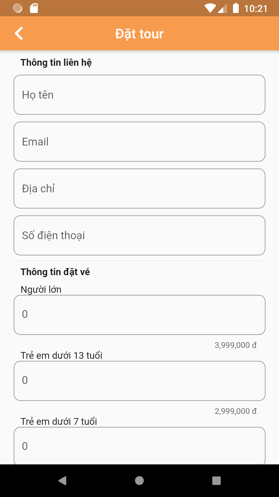

# Ứng dụng đặt tour du lịch

Ứng dụng giúp đặt tour du lịch, đồng thời tạo nên diễn đàn để mọi người chia sẽ trải nghiệm du lịch của mình với mọi người.

## Nội dung

1. [Chức năng](#chức-năng)

   1. [Đăng nhập / Đăng kí](#đăng-nhập-/-đăng-kí)

   1. [Xem danh sách tour](#xem-danh-sách-tour)

   1. [Xem chi tiết tour](#xem-chi-tiết-tour)

   1. [Tìm kiếm tour](#tìm-kiếm-tour)

   1. [Xem bài viết du lịch](#xem-bài-viết-du-lịch)

   1. [Đăng bài viết du lịch](#đăng-bài-viết-du-lịch)

   1. [Đặt tour](#đặt-tour)

1. [Yêu cầu thiết bị](#yêu-cầu-thiết-bị)

1. [Thư viện và công nghệ](#thư-viện-và-công-nghệ)

1. [Backend / Database / Diagram](#backend-/-database-/-diagram)

1. [Tác giả](#tác-giả)

## Chức năng

### Đăng nhập / Đăng kí

- Đăng nhập

   

    
   

  
- Đăng kí
   
   

   
   

    
### Xem danh sách tour
   * Top tour
   

   
   * Danh sách tour
   

   
  
### Xem chi tiết tour
   * Chi tiết tour
     
   

    
   

### Tìm kiếm tour
- Tìm kiếm tour

   

    
   

### Xem bài viết du lịch

   

   
   

### Đăng bài viết du lịch

- Đăng bài viết du lịch

   

    
   

### Đặt tour
   * Đặt tour
   
   

    
   

   
## Yêu cầu thiết bị
-Android:

+Android studio : 4.1.1

+Min sdk : 16

+Target sdk : 29

## Thư viện và công nghệ

- Language : Dart

- FrameWork : Flutter

- Database: REST API

- Flutter: https://flutter.dev

- cupertino_icons: https://pub.dev/packages/cupertino_icons

- carousel_pro: https://pub.dev/packages/carousel_pro

- websafe_svg: https://pub.dev/packages/websafe_svg

- intl: https://pub.dev/packages/intl

- url_launcher: https://pub.dev/packages/url_launcher

- momo_vn: https://pub.dev/packages/momo_vn

- fluttertoast: https://pub.dev/packages/fluttertoast

- http: https://pub.dev/packages/http

- image_picker: https://pub.dev/packages/image_picker

- auto_size_text: https://pub.dev/packages/auto_size_text

## Backend / Database / Diagram
-Backend:

+ Ngôn ngữ: Java

+ FrameWork: Spring boot

+ Nền tải triển khai: Heroku

+ Link: https://travelbooking4uit.herokuapp.com/swagger-ui.html

-Database: MySQL

-Diagram:

   
   

## Tác giả

Nguyễn Trọng Khanh - 17520627@gm.uit.edu.vn

Lý Đạo Nam - 17520777@gm.uit.edu.vn
